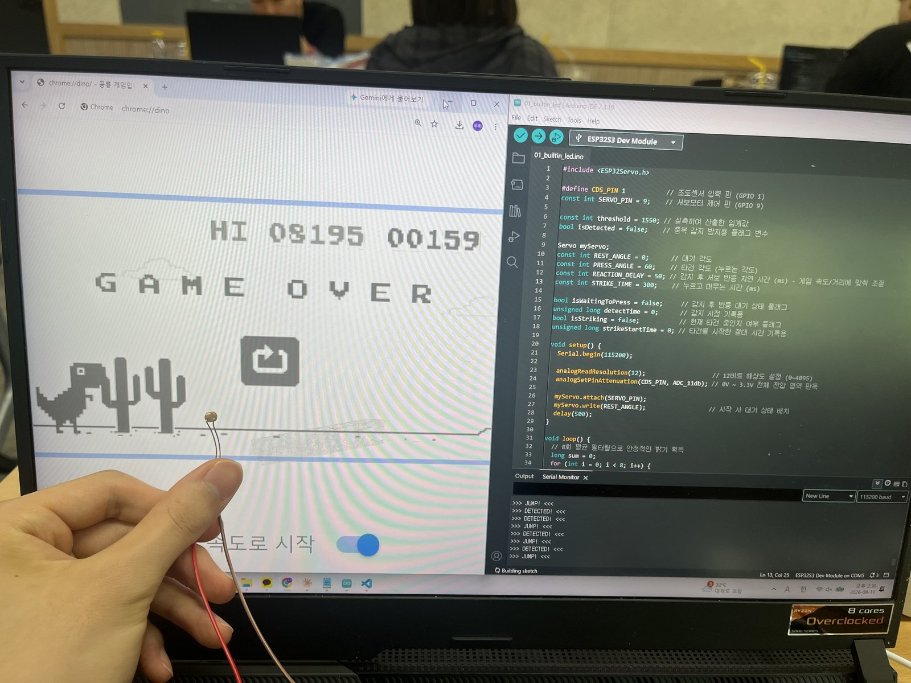
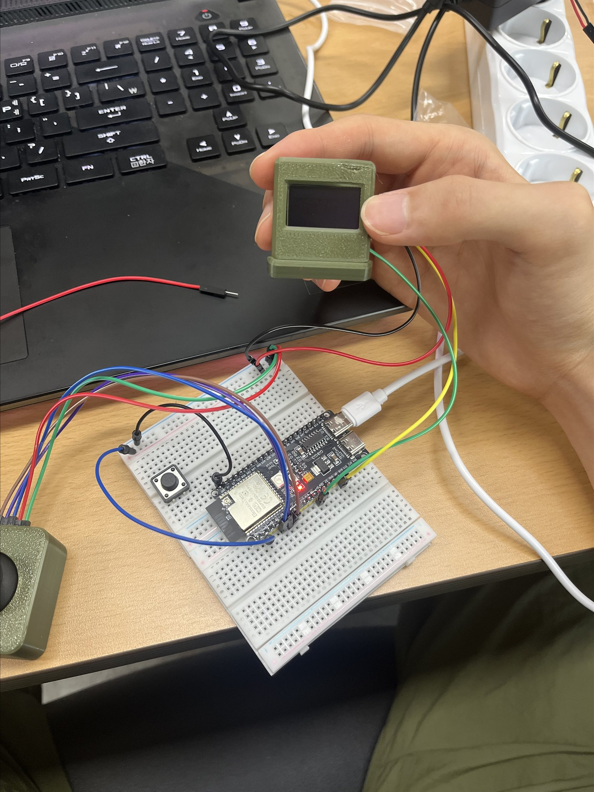
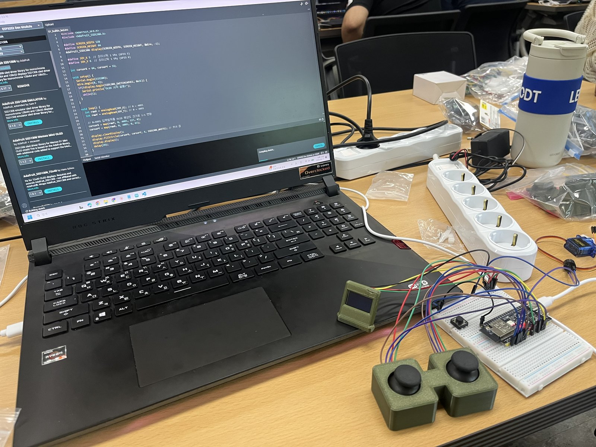

# 📡 Physical AI 부트캠프 — Day 2: 조도센서·서보모터로 게임 자동화, 조이스틱으로 OLED 제어

> 팀 모노리스 / 오프라인 수업 정리
> 주제: 전압 분배 원리 이해 → 조도센서+서보모터로 크롬 공룡 게임 자동 점프 → 조이스틱+OLED 좌표 제어
> 오늘은 이론보다 **활동 위주**로 진행되어 코드·회로 실습 위주로 정리했다.

---

## 목차

1. [오늘 활동 개요](#1-오늘-활동-개요)
2. [활동 ① 조도센서 + 서보모터로 크롬 공룡 게임 자동 점프](#2-활동--조도센서--서보모터로-크롬-공룡-게임-자동-점프)
3. [활동 ② 조이스틱 + OLED로 좌표 기반 커서 그리기](#3-활동--조이스틱--oled로-좌표-기반-커서-그리기)
4. [핵심 개념: 전압 분배와 ADC](#4-핵심-개념-전압-분배와-adc)
5. [핵심 개념: 3.3V/5V 레일 분리와 공용 GND](#5-핵심-개념-33v5v-레일-분리와-공용-gnd)
6. [오늘 느낀 점](#6-오늘-느낀-점)
7. [참고 자료](#7-참고-자료)
8. [오늘의 실습 사진](#8-오늘의-실습-사진)

---

## 1. 오늘 활동 개요

어제(Day 1)가 디지털 출력/입력 기초를 익히는 시간이었다면, 오늘은 **아날로그 입력(조도센서)** 과 **아날로그 입력 2개를 동시에 다루는 조이스틱**을 가지고 실제로 뭔가 "동작하는" 결과물을 만드는 활동 위주 수업이었다.

- 활동 ①: 조도센서(CDS)로 빛의 변화를 감지해서 서보모터가 자동으로 스페이스바를 눌러주는 크롬 공룡 게임 자동 점프기
- 활동 ②: 조이스틱 2축 입력을 OLED 디스플레이 좌표로 변환해서 커서를 그리는 실습

---

## 2. 활동 ① 조도센서 + 서보모터로 크롬 공룡 게임 자동 점프

### 원리
조도센서(CDS, Cadmium Sulfide 광센서)로 밝기 변화를 감지하고, 그 값이 특정 **임계값(threshold)** 을 넘으면(혹은 아래로 떨어지면) 서보모터를 움직여 물리적으로 키를 눌러주는 방식이다.

- 조도센서 측정값 범위: 대략 **1200 ~ 1900**
- 이 범위의 중간값 부근을 **임계값(threshold)** 으로 잡아서, 값이 이 기준을 지나가는 순간을 "변화가 생겼다(감지됨)"로 판단한다.
### 코드 (일부 — 초기화.�� *��지 및 감지 로직 시작 부분)

```cpp
#include <ESP32Servo.h>

#define CDS_PIN 1          // 조도센서 입력 핀 (GPIO 1)
const int SERVO_PIN = 9;   // 서보모터 제어 핀 (GPIO 9)

const int threshold = 1550; // 실측하여 산출한 임계값
bool isDetected = false;    // 중복 감지 방지용 플래그 변수

Servo myServo;
const int REST_ANGLE = 0;      // 대기 각도
const int PRESS_ANGLE = 60;    // 타건 각도 (누르는 각도)
const int REACTION_DELAY = 50; // 감지 후 서보 반응 지연 시간 (ms) - 게임 속도/거리에 맞춰 조절
const int STRIKE_TIME = 300;   // 누르고 머무는 시간 (ms)

bool isWaitingToPress = false;     // 감지 후 반응 대기 상태 플래그
unsigned long detectTime = 0;      // 감지 시점 기록용
bool isStriking = false;           // 현재 타건 중인지 여부 플래그
unsigned long strikeStartTime = 0; // 타건을 시작한 절대 시간 기록용

void setup() {
  Serial.begin(115200);

  analogReadResolution(12); // 12비트 해상도 설정 (0~4095)
  analogSetPinAttenuation(CDS_PIN, ADC_11db); // 0V ~ 3.3V 전체 전압 영역 판독

  myServo.attach(SERVO_PIN);
  myServo.write(REST_ANGLE); // 시작 시 대기 상태 배치
  delay(500);
}

void loop() {
  // 8회 평균 필터링으로 안정적인 밝기 획득
  long sum = 0;
  for (int i = 0; i < 8; i++) {
    // (이하 감지·서보 구동 로직은 사진에 다 담기지 않아 생략)
  }
}
```

> ⚠️ 위 코드는 사진에 찍힌 범위(약 34번째 줄)까지만 옮긴 것이다. `loop()` 뒷부분(임계값 비교 → 서보 동작)은 화면에서 잘려 정확한 코드는 남기지 못했다. 다만 시리얼 모니터에 `DETECTED!` → `JUMP!` 순서로 로그가 찍히는 걸 보면, 조도 변화 감지 → `REACTION_DELAY`만큼 대기 → 서보를 `PRESS_ANGLE`까지 움직여 `STRIKE_TIME` 동안 눌렀다가 `REST_ANGLE`로 복귀하는 흐름으로 동작한 것으로 보인다.

### 관찰
- `analogSetPinAttenuation(CDS_PIN, ADC_11db)`로 감쇠(attenuation)를 11dB로 설정하면 0V~3.3V 전 범위를 다 읽을 수 있다. 감쇠를 안 걸면 ESP32 ADC가 읽을 수 있는 전압 범위가 좁아져서 조도센서 값의 일부 구간을 놓칠 수 있다.
- 8회 평균 필터링을 쓴 이유: 조도센서 값이 순간적으로 흔들릴 수 있어서, 여러 번 읽은 값을 평균 내 노이즈를 줄이기 위함으로 보인다.

---

## 3. 활동 ② 조이스틱 + OLED로 좌표 기반 커서 그리기

### 원리
조이스틱은 X축, Y축 각각 가변저항으로 되어 있어서 아날로그 입력 2개(0~4095)가 나온다. 이 값을 OLED 화면 해상도(128×64)에 맞게 **1:1로 매핑(map)** 해서, 조이스틱을 움직이는 대로 화면 위의 원(커서)이 따라 움직이게 만드는 실습이었다.

### 코드 (전체)

```cpp
#include <Adafruit_GFX.h>
#include <Adafruit_SSD1306.h>

#define SCREEN_WIDTH 128
#define SCREEN_HEIGHT 64
Adafruit_SSD1306 display(SCREEN_WIDTH, SCREEN_HEIGHT, &Wire, -1);

#define JOY_X 5   // 조이스틱 1 Vrx (GPIO 5)
#define JOY_Y 6   // 조이스틱 1 Vry (GPIO 6)

int cursorX = 64, cursorY = 32;

void setup() {
  Serial.begin(115200);
  Wire.begin(8, 9);
  if (!display.begin(SSD1306_SWITCHCAPVCC, 0x3C)) {
    Serial.println("OLED 시작 실패!");
    while (1);
  }
}

void loop() {
  int rawX = analogRead(JOY_X); // 0 ~ 4095
  int rawY = analogRead(JOY_Y); // 0 ~ 4095

  // 0~4095 입력값을 OLED 해상도 크기로 1:1 변환
  cursorX = map(rawX, 0, 4095, 0, 127);
  cursorY = map(rawY, 0, 4095, 0, 63);

  display.clearDisplay();
  display.fillCircle(cursorX, cursorY, 4, SSD1306_WHITE); // 커서 점
  display.display();
  delay(20);
}
```

### 관찰
- `Wire.begin(8, 9)`로 I2C의 SDA=GPIO8, SCL=GPIO9를 직접 지정했다. OLED는 SSD1306 컨트롤러, I2C 주소 `0x3C`.
- `map()` 함수로 조이스틱의 원시 입력 범위(0~4095)를 화면 좌표 범위(0~127, 0~63)로 그대로 축소 변환한다.
- `delay(20)`으로 약 50Hz 주기로 화면을 갱신 — 사람 눈에는 부드럽게 따라오는 것처럼 보였다.

---

## 4. 핵심 개념: 전압 분배와 ADC

오늘 가장 크게 이해한 부분. ESP32는 저항이나 전류를 직접 재는 센서가 아니라 **전압만 읽을 수 있는 ADC(아날로그-디지털 변환기)** 를 가지고 있다. 그런데 조도센서는 빛의 양에 따라 저항값이 변하는 부품이라, 이 저항 변화를 ESP32가 이해할 수 있는 "전압 변화"로 바꿔줘야 한다.

그래서 쓰는 방법이 **전압 분배(Voltage Divider)** 다.
- 조도센서(가변저항 역할)와 고정 저항을 3.3V와 GND 사이에 **직렬로** 연결한다.
- 두 저항을 사이의 중간 지점 전압을 ESP32의 ADC 핀으로 읽는다.
- 빛이 밝아져 조도센서 저항이 작아지면 → 중간 지점 전압이 변하고, ESP32는 그 전압 변화를 숫자(0~4095)로 읽는다.

오늘 직접 관찰한 것처럼 "GND는 어디로 연결하든 상관없더라"는 이 원리와 맞아떨어진다. GND는 회로 전체의 **기준 전위(0V)** 역할만 하면 되기 때문에, 3.3V 레일에서 나왔든 5V 레일에서 나왔든 결국 ESP32로 돌아오기만 하면 회로가 정상 동작한다.

---

## 5. 핵심 개념: 3.3V/5V 레일 분리와 공용 GND

브레드보드에는 보통 전원 레일이 두 줄 있는데, 오늘은 이걸 **3.3V용, 5V용으로 나눠서** 사용했다.
- ESP32 본체와 조도센서 같은 로직/센서 쪽은 3.3V 기준으로 동작한다.
- 서보모터처럼 더 큰 힘(전류)이 필요한 액추에이터는 5V 레일에서 전원을 끌어다 썼다.

즉, "전압이 다른 부품을 같은 회로 안에서 같이 쓰려면, 레일을 분리해서 각자 필요한 전압만 공급해주면 된다"는 걸 실습으로 확인한 시간이었다.

---

## 6. 오늘 느낀 점

- **5.5V로 전압을 살짝 올리는 방법**을 접했다. 서보모터처럼 순간적으로 전류를 더 필요로 하는 부품에 여유 있는 전압을 공급해서 더 안정적으로 구동시키려는 목적으로 이해했는데, 정확한 회로 구성(부스트 컨버터인지 별도 전원인지)은 다음 시간에 다시 확인해보고 싶다.
- 브레드보드에서 3.3V/5V 레일을 나눠 쓰는 감을 잡았다. 부품마다 필요한 전력이 다르다는 걸 회로로 직접 확인하니 이해가 빨랐다.
- ESP32가 저항·전류를 직접 못 읽어서(→ 전압만 읽을 수 있어서) 조도센서와 GND 사이에 저항을 하나 더 둬서 전압 분배로 신호를 인지하게 만든 부분이 오늘의 핵심 "아하" 포인트였다.
- 생각보다 센서 감지 → 서보 반응까지의 속도가 빨라서 신기했다. (코드상 `REACTION_DELAY = 50ms`, `STRIKE_TIME = 300ms` 정도로 조절해도 게임 타이밍을 맞출 수 있을 만큼 반응이 빨랐다.)

---

## 7. 참고 자료

- 코들(codle.io) 클래스룸 자료 — [2주차 자료 링크](https://codle.io/classrooms/16251/materials/74747/view/activities/502904) (1주차 마지막 부분도 함께 참고)
  - ⚠️ 로그인이 필요한 클래스룸 페이지라 이 문서를 정리하며 내용을 직접 확인하지는 못했다. 링크만 남겨두고, 나중에 로그인한 상태에서 내용을 보충할 것.

---

## 8. 오늘의 실습 사진

### 조도센서 + 서보모터로 크롬 공룡 게임 자동 점프


### 조이스틱 + OLED 좌표 커서 (완성된 3D 프린팅 케이스)


### 라이브러리 설치 및 코드 작성 화면 (Adafruit SSD1306)


> 📹 오늘 활동은 영상으로 남기면 더 잘 이해됐을 것 같은데, 이번엔 사진으로만 정리했다. 다음엔 짧게라도 영상을 남겨봐야겠다.

---

## ✅ 오늘의 성과 요약

- [x] 조도센서(CDS) 값 범위 실측 및 임계값(threshold) 설정 원리 이해
- [x] 서보모터로 물리적 키 입력을 자동화하는 실습 (조도센서 → 서보 → 크롬 공룡 게임)
- [x] 조이스틱 2축 아날로그 입력을 OLED 좌표로 매핑하는 실습
- [x] 전압 분배(Voltage Divider) 원리로 ESP32가 저항 변화를 읽는 방법 이해
- [x] 브레드보드 3.3V/5V 레일 분리 및 공용 GND 개념 이해
- [ ] 5.5V 승압 방법의 정확한 원리는 다음 시간에 재확인 필요

---

*Physical AI 부트캠프 Day 2 학습 정리 — 팀 모노리스*
