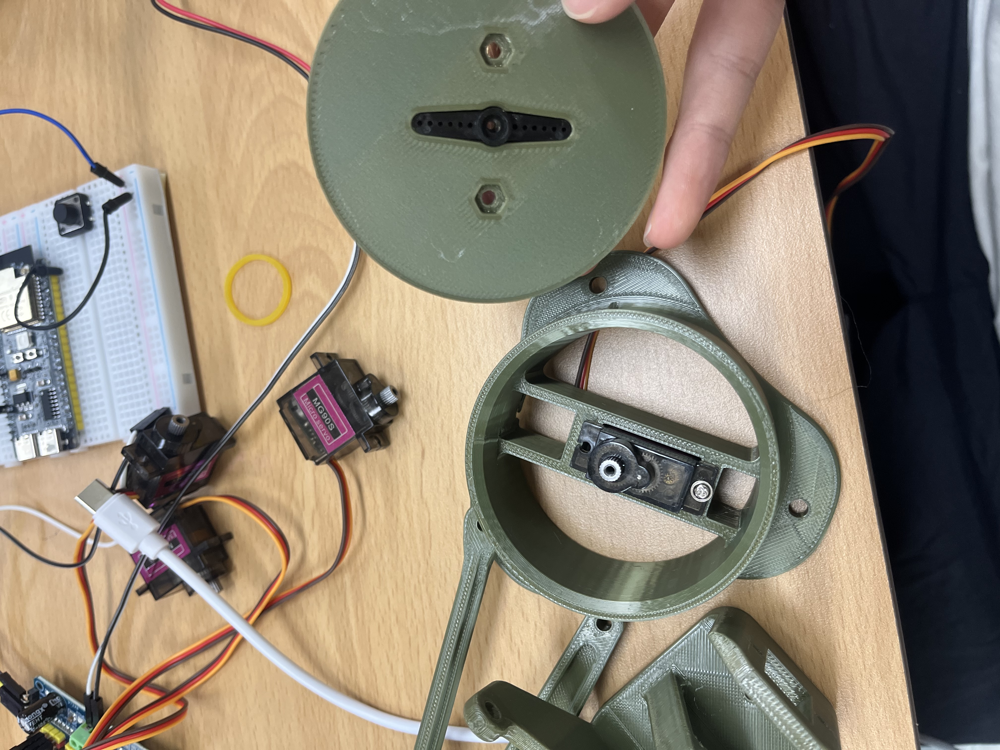
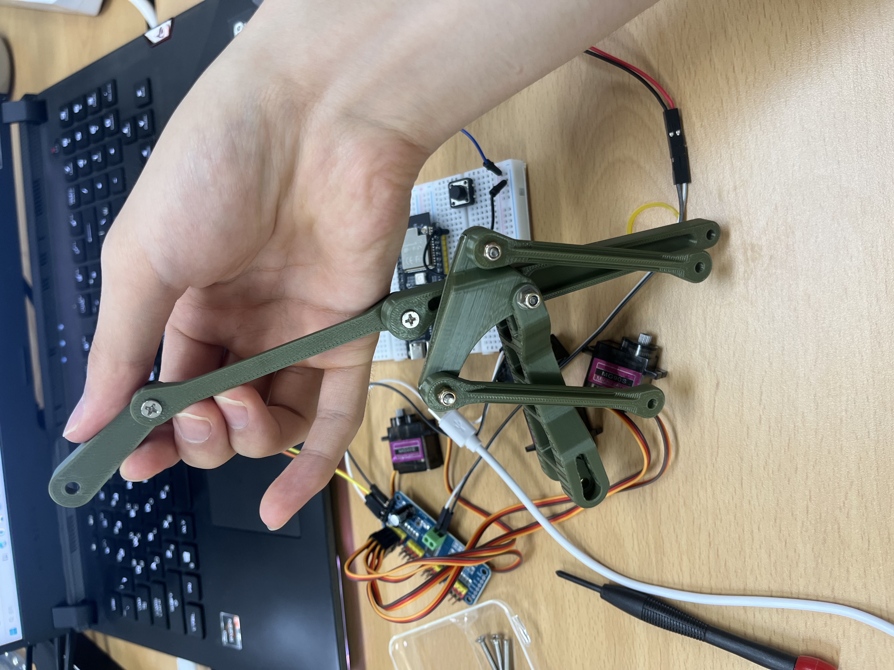
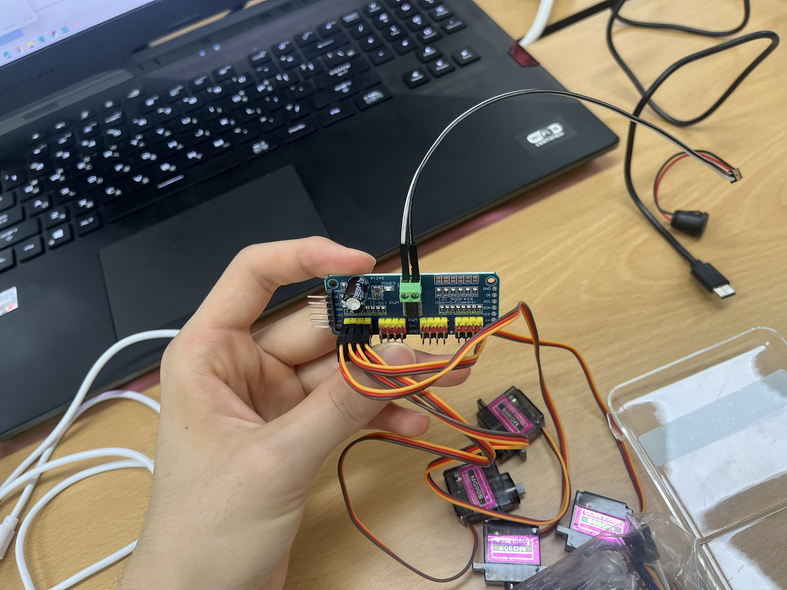
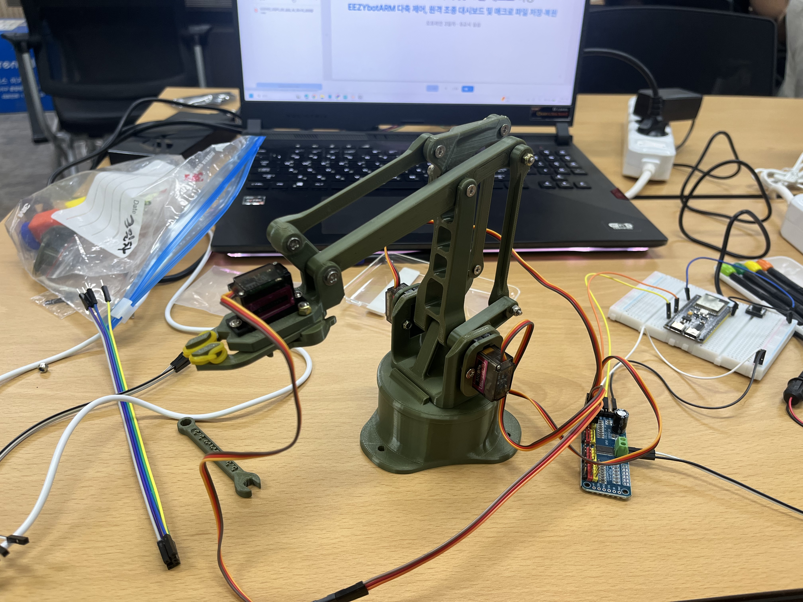

# 🦾 Physical AI 부트캠프 — Day 3: 4축 로봇팔 제작과 무선 제어

> 팀 모노리스 / 오프라인 수업 정리
> 하루 흐름: 게임 마무리 → 로봇팔 조립 → PCA9685 배선 → 90도 초기화 → 웹 슬라이더 조종 → ESP32 자체 서버로 폰 조종
> 수업은 모션 티칭(매크로)까지 진도가 나갔지만, 이 문서는 **내가 직접 만들고 눈으로 확인한 ESP32 서버화 단계까지만** 기록한다.

---

## 오늘의 흐름 한눈에

| 단계 | 활동 | 결과물 | 증빙 |
|---|---|---|---|
| 1 | 우주선 슈팅 게임 마무리 | 2인 대전 · 1인 AI 대전 | 코드 |
| 2 | 4축 로봇팔 조립 (90도 기준) | 조립 완료 | 사진 ①②③ |
| 3 | PCA9685 + 서보 4개 배선 | 배선 완료 | 사진 ④, 영상 1 |
| 4 | 코드로 4축 90도 정렬 | 홈 자세 확립 | 코드 |
| 5 | 웹 슬라이더로 USB 조종 | 슬라이더 → 팔 동작 | 사진 ⑤⑥, 영상 2·3 |
| 6 | ESP32를 AP 서버로 → 폰 조종 | 케이블 없이 조종 | 사진 ⑦ |

**시연 영상 3개** (링크 있는 사람만 시청 가능 · 일부 공개)

| 영상 | 내용 | 길이 | 링크 |
|---|---|---|---|
| 1 | 로봇팔 조립·배선 과정 | 0:18 | [보기](https://youtube.com/shorts/sPT2LusD6M0) |
| 2 | 웹 슬라이더로 로봇팔 조종 | 0:37 | [보기](https://youtu.be/YqXy-5ZxE0M) |
| 3 | 웹 슬라이더 조종 (전체 동작) | 1:30 | [보기](https://youtube.com/shorts/Tixqef-2xvM) |

---

## 1. 우주선 슈팅 게임 마무리

어제까지 만든 OLED 슈팅 게임(조이스틱 + 부저)을 두 갈래로 완성했다.

- **2인 대전**: 조이스틱 2개로 화면을 좌우로 나눠(왼쪽 P1 / 오른쪽 P2) 서로 총알을 쏘는 대결. HP 3개, 먼저 0이 되면 패배.
- **1인 AI 대전**: 조이스틱 1개만 쓰고 상대 자리를 AI로 교체. AI는 ① 다가오는 총알 회피 → ② 없으면 플레이어 Y좌표 추적 → ③ 가끔 랜덤 방향 전환, 3단계 우선순위로 움직인다. 라운드를 이길수록 속도·연사가 빨라진다.

### 여기서 배운 것

- **총알을 배열로 관리하는 패턴.** 기존엔 `missileActive` 변수 하나로 총알 1발만 다뤘는데, `Bullet bullets[MAX_BULLETS]`로 배열을 만들고 `active` 플래그로 빈 슬롯을 재사용하면 여러 발을 동시에 관리할 수 있다. 이 패턴은 이후 로봇팔의 4축 각도 배열(`servoAngles[4]`)에서도 똑같이 쓰였다.
- **`delay()` 대신 `millis()`.** `delay()`는 그 시간 동안 프로그램 전체가 멈춘다. 발사 간격을 `millis()` 기반 쿨다운으로 바꾸니 소리가 나는 동안에도 게임이 계속 돌아갔다.

---

## 2. 4축 로봇팔 조립 — 90도가 기준이다

### 사진 ① 부품 확인과 서보 준비



### 사진 ② 베이스 관절 조립


### 사진 ③ 링키지 암 조립



### 오늘 가장 중요했던 원칙

서보모터는 0~180도로 움직인다. 그런데 **90도가 물리적으로 정중앙에 오도록 조립**해야 양쪽으로 균등하게 움직일 수 있다. 90도가 한쪽으로 치우친 채 조립하면 그 방향의 가동범위가 잘려서 나중에 매우 귀찮아진다.

그래서 조립 순서가 중요하다:

1. **먼저 코드로 서보를 90도로 보낸다** (혼을 끼우지 않은 상태에서)
2. 그 상태에서 팔 부품을 원하는 자세 방향으로 끼운다
3. 즉, **부품을 끼우는 각도가 "90도 = 이 자세"를 정의한다**

예외가 하나 있다. **집게(그리퍼)는 살짝 벌어진 상태를 90도로 잡는 게 좋다.** 완전히 닫힌 상태를 90도로 두면 물체를 잡으러 갈 때 여유가 없다.

조립 치수 메모: 12 / 16 / 20 / 25 / 30

### ⚠️ 막혔던 부분 — 서보에서 "지지직" 소리가 계속 났다

조립 중 한 서보에서 계속 지지직거리는 소리가 났다. 원인은 두 가지가 겹친 것이었다.

- 해당 **서보 자체가 불량**이었다 → 새 서보로 교체
- 기구부를 **너무 꽉 조여서** 서보가 목표 각도까지 못 가고 힘만 계속 쓰는 상태 → 부품 체결을 살짝 느슨하게 풀어서 해결

이 상태를 **스톨(stall)** 이라고 부른다는 걸 배웠다. 서보는 0~180 명령을 다 받아들이지만, **기구부의 실제 물리 한계는 그보다 훨씬 좁다.** 한계에 닿았는데도 명령이 계속 들어가면 멈춘 채 토크만 걸려서 발열되고 결국 고장난다.

그래서 새 자세를 시도할 때 지켜야 할 규칙:

- 90도에서 시작해 **5~10도씩만** 조금씩 움직여 내 로봇의 실제 최소/최대 각도를 찾는다
- "지잉—" 소리가 들리면 **즉시 반대 방향으로 되돌린다**
- 링크로 연결된 두 관절(어깨·팔꿈치)은 서로 영향을 주므로, 한 번 찾은 한계도 자세가 바뀌면 다시 확인해야 한다

---

## 3. PCA9685로 서보 4개 연결하기

### 사진 ④ PCA9685 서보 드라이버와 서보 4개



### 왜 ESP32에 서보를 직접 안 달고 PCA9685를 쓰나?

이유는 **전원**이다.

- 서보모터는 움직일 때 **개당 수백 mA**를 먹는다. 4개를 ESP32의 3.3V 핀에서 끌어오면 보드가 리셋되거나 파손될 수 있다.
- PCA9685는 **서보 전원(V+)을 외부 5V에서 따로** 받아 전원 문제를 ESP32와 분리한다.
- 그러면서 ESP32와는 **통신선 2가닥(SDA/SCL, I2C)** 만으로 최대 16채널을 제어한다.
- 한 줄 요약: **전원은 분리, 제어는 I2C 두 가닥.**

### 배선 정리

| PCA9685 핀 | 연결 대상 | 비고 |
|---|---|---|
| VCC (로직 전원) | ESP32 3.3V | 칩 구동용 — 서보 전원 아님 |
| GND | ESP32 GND | 공통 그라운드 |
| SDA (데이터) | GPIO 8 | I2C |
| SCL (클럭) | GPIO 9 | I2C — OLED도 같은 선을 함께 씀 |
| V+ / GND (터미널 블록) | **외부 5V 2~3A** | ⚠️ ESP32 3.3V에 연결 절대 금지 |
| 서보 4개 | 채널 0~3 | 선 색: 노랑 Signal / 빨강 V+ / 갈색 GND |

**채널 배정:** CH0 밑동 회전 · CH1 어깨 · CH2 팔꿈치 · CH3 집게

**필요 라이브러리:** `Adafruit PWM Servo Driver Library`, `ArduinoJson`

📹 **영상 1 — 조립·배선 과정** → https://youtube.com/shorts/sPT2LusD6M0

---

## 4. 코드로 4축을 90도에 맞추기

### 핵심은 함수 하나

```cpp
#define SERVOMIN 150  // 0도에 해당하는 펄스 (12비트 값)
#define SERVOMAX 600  // 180도에 해당하는 펄스

void setServoAngle(int channel, int angle) {
  int pulse = map(angle, 0, 180, SERVOMIN, SERVOMAX);
  pwm.setPWM(channel, 0, pulse);
}
```

서보는 50Hz PWM 신호의 **펄스 폭**으로 각도를 판단한다. `map()`으로 0~180도를 150~600 펄스값 범위에 대응시키는 것이 전부다.

<details>
<summary>전체 코드 — 4축 90도 초기화</summary>

```cpp
#include <Wire.h>
#include <Adafruit_PWMServoDriver.h>

#define I2C_SDA 8
#define I2C_SCL 9

Adafruit_PWMServoDriver pwm = Adafruit_PWMServoDriver();

#define SERVOMIN 150
#define SERVOMAX 600

void setServoAngle(int channel, int angle) {
  int pulse = map(angle, 0, 180, SERVOMIN, SERVOMAX);
  pwm.setPWM(channel, 0, pulse);
}

void setup() {
  Serial.begin(115200);
  delay(2000);
  Wire.begin(I2C_SDA, I2C_SCL);   // ESP32-S3 I2C 핀 명시 지정
  pwm.begin();
  pwm.setOscillatorFrequency(27000000);
  pwm.setPWMFreq(50);             // 서보는 50Hz
  delay(50);
  for (int ch = 0; ch < 4; ch++) setServoAngle(ch, 90);
  Serial.println("모든 모터(CH 0~3) 90도 전송 완료!");
}

void loop() {
  // 전원이 늦게 켜져도 반영되도록 1초마다 90도를 재전송
  for (int ch = 0; ch < 4; ch++) setServoAngle(ch, 90);
  delay(1000);
}
```

</details>

### ⚠️ 막혔던 부분 — "90도로 갔는지 눈으로 확인이 안 된다"

코드를 올리니 소리는 들리는데 서보가 거의 안 움직여서 90도가 맞는지 알 수 없었다. 이유를 알아보니:

- **일반 취미용 서보는 현재 위치 값을 밖으로 돌려주지 않는다.** 내부에 위치 센서(가변저항)가 있지만 그 값을 읽을 수 없는 단방향 구조다. 즉 각도를 확인할 수 있는 "값"이 애초에 존재하지 않는다.
- 소리만 나고 안 움직인 건 **이미 90도 근처에 있어서** 그 자리를 유지하려고 미세하게 힘을 주는 정상 동작이었다.

**확인 방법:** 90도가 진짜 중앙인지는 `0 → 90 → 180 → 90` 스윕을 시켜서 **양쪽으로 도는 양이 비슷한지 눈으로 비교**하는 방법뿐이다. 값이 없으면 눈이 계측기다.

---

## 5. 웹 슬라이더로 로봇팔 조종하기 (Web Serial + JSON)

### 사진 ⑤ 완성된 로봇팔과 PCA9685 연결


### 사진 ⑥ 세워진 로봇팔 전체 모습



### 구조

```
브라우저 슬라이더 → JSON 한 줄 → USB(Web Serial) → ESP32 파싱 → 서보 4개 회전
```

프로토콜은 딱 한 줄이다: `{"s0":90,"s1":110,"s2":60,"s3":45}`

### 여기서 배운 것 — "약속(프로토콜)"의 설계

- **왜 JSON 한 줄로 묶나?** 각도를 하나씩 따로 보내면 관절이 순차적으로 움직여 동작이 어색해진다. 네 개를 한 줄에 묶어 보내면 보드가 한 번에 받아 **동시에 반영**한다. 게다가 사람이 눈으로 읽을 수 있어서 문제가 생겼을 때 바로 확인된다.
- **왜 끝에 `\n`을 붙이나?** 보드 입장에서는 글자가 계속 흘러들어오는 것뿐이라 "어디까지가 한 줄인지" 알 수 없다. 엔터가 그 경계 표시다.
- **Web Serial API**: 브라우저가 USB 시리얼 포트에 직접 연결하는 기능. 설치할 프로그램도, 서버도 필요 없다. Chrome·Edge에서만 동작한다.

### 코드에서 중요했던 두 지점

```cpp
#define BASE_CH 0   // 밑동(좌우 회전) = PCA9685 CH 0

void setServoAngle(int channel, int angle) {
  if (channel == BASE_CH) angle = 180 - angle;  // ← 밑동만 좌우 반전
  int pulse = map(angle, 0, 180, SERVOMIN, SERVOMAX);
  pwm.setPWM(channel, 0, pulse);
}
```

- **밑동 축 반전**: 서보가 조립된 방향 때문에 각도를 올릴수록 팔이 왼쪽으로 돌았다. 슬라이더를 오른쪽으로 밀면 팔도 오른쪽으로 돌게 하려고, 이 축만 내보내기 직전에 `180 - angle`로 뒤집었다.
- **`constrain(0, 180)`**: 범위 밖 값이 들어오면 잘라낸다. 이게 없으면 기구부 한계를 넘는 명령이 그대로 나가서 스톨이 발생한다.

<details>
<summary>전체 코드 — 아두이노 쪽 JSON 수신</summary>

```cpp
#include <Adafruit_PWMServoDriver.h>
#include <ArduinoJson.h>
#include <Wire.h>

Adafruit_PWMServoDriver pwm = Adafruit_PWMServoDriver();
#define SERVOMIN 150
#define SERVOMAX 600

// ⚠️ 초기각도는 반드시 전부 90 (90도 기준으로 조립했으므로)
int servoAngles[4] = {90, 90, 90, 90};

#define BASE_CH 0
void setServoAngle(int channel, int angle) {
  if (channel == BASE_CH) angle = 180 - angle;
  int pulse = map(angle, 0, 180, SERVOMIN, SERVOMAX);
  pwm.setPWM(channel, 0, pulse);
}

void setup() {
  Serial.begin(115200);
  delay(1500);
  Wire.begin(8, 9);
  pwm.begin();
  pwm.setOscillatorFrequency(27000000);
  pwm.setPWMFreq(50);
  delay(10);
  for (int i = 0; i < 4; i++) setServoAngle(i, servoAngles[i]);
}

void loop() {
  if (Serial.available() > 0) {
    StaticJsonDocument<200> doc;
    DeserializationError error = deserializeJson(doc, Serial);
    if (!error) {
      if (doc.containsKey("s0")) servoAngles[0] = doc["s0"];
      if (doc.containsKey("s1")) servoAngles[1] = doc["s1"];
      if (doc.containsKey("s2")) servoAngles[2] = doc["s2"];
      if (doc.containsKey("s3")) servoAngles[3] = doc["s3"];
      for (int i = 0; i < 4; i++) {
        servoAngles[i] = constrain(servoAngles[i], 0, 180);
        setServoAngle(i, servoAngles[i]);
      }
    } else {
      while (Serial.available() > 0) Serial.read();  // 깨진 데이터 버리기
    }
  }
}
```

</details>

### ⚠️ 막혔던 부분 — `Failed to execute 'open' on 'SerialPort'`

웹페이지에서 [로봇 연결]을 눌렀는데 이 에러가 떴다.

```
연결 에러: Failed to execute 'open' on 'SerialPort':
Failed to open serial port.
```

**원인:** 시리얼 포트는 **한 번에 한 프로그램만** 열 수 있다. 아두이노 IDE의 시리얼 모니터가 COM5를 점유하고 있어서 브라우저가 같은 포트를 열 수 없었던 것.

**해결:** 아두이노 IDE의 시리얼 모니터 탭을 닫고 웹페이지에서 다시 연결.

여기서 앞으로도 계속 적용될 규칙을 얻었다 — **시리얼 모니터와 웹페이지는 양자택일이다.** 보드의 디버그 출력(`Updated Angles -> ...`)을 보고 싶으면 웹 연결을 끊어야 하고, 반대도 마찬가지다.

📹 **영상 2 — 웹 슬라이더로 조종** → https://youtu.be/YqXy-5ZxE0M
📹 **영상 3 — 전체 동작** → https://youtube.com/shorts/Tixqef-2xvM

---

## 6. ESP32를 서버로 만들어 폰으로 조종 (AP 모드)

### 사진 ⑦ 시리얼 모니터에 뜬 내 보드의 Wi-Fi 정보


### 5단계와 무엇이 달라졌나

| 구분 | 웹 슬라이더 (USB) | ESP32 서버 (AP 모드) |
|---|---|---|
| 웹페이지 위치 | 내 PC (Live Server) | **보드 안** (코드 속 문자열) |
| 전달 통로 | USB 시리얼 | Wi-Fi (HTTP) |
| 데이터 형식 | JSON 한 줄 | URL 파라미터 `/set?ch=0&ang=120` |
| 필요한 것 | PC + 케이블 | **폰만** (인터넷도 불필요) |

### 오늘 확실하게 이해한 세 가지

**① USB는 이제 전원 공급용이다.**
데이터 송수신은 ESP32가 Wi-Fi로 직접 한다. 노트북은 POWER 역할만 한다. 보조배터리로 바꾸면 컴퓨터 자체가 필요 없다.

**② ESP32가 스스로 공유기가 된다 (AP 모드).**
평소 아는 방식은 ESP32가 집 공유기에 "접속하는 쪽"(Station 모드)인데, `WiFi.softAP()` 한 줄로 반대가 된다 — ESP32가 전파를 쏘는 공유기가 되는 것. 집 공유기·인터넷과 완전히 무관한 독립 폐쇄망이 생기고, `192.168.4.1`은 그 네트워크에서 보드가 스스로에게 부여한 IP다.

보드마다 Wi-Fi 이름이 다른 이유도 알았다:

```cpp
uint8_t mac[6];
WiFi.softAPmacAddress(mac);
sprintf(suffix, "%02X%02X", mac[4], mac[5]);  // MAC 뒤 2바이트만
apSSID = "RobotArm-" + String(suffix);
WiFi.softAP(apSSID.c_str(), AP_PASSWORD);      // 이 한 줄로 공유기가 됨
```

MAC 주소는 모든 네트워크 장치의 고유번호인데, **앞 3바이트는 제조사 공통**이라 쓰면 안 되고 **뒤 2바이트**만 떼서 붙인다. 그래서 교실에서 30명이 동시에 켜도 `RobotArm-3F2A`처럼 서로 다른 이름이 나온다.

**③ 홈페이지를 보드가 "기억"한다.**
HTML 전체가 이렇게 코드 안에 문자열 상수 하나로 박혀 있다:

```cpp
const char PAGE_HTML[] PROGMEM = R"HTML(
<!DOCTYPE html><html lang="ko"> ... </html>
)HTML";
```

컴파일하면 이 문자열이 펌웨어에 포함되어 **플래시 메모리**(전원 꺼도 지워지지 않는 저장소)에 저장된다. `PROGMEM`이 "RAM 말고 플래시에 둬라"는 표시다. 폰이 접속하면 `handleRoot()`가 이 문자열을 그대로 전송하고, 브라우저는 받은 게 파일인지 문자열인지 구분하지 못하니 그냥 페이지로 렌더링한다.

### 요청 라우팅

```cpp
server.on("/", handleRoot);        // 컨트롤 페이지 전송
server.on("/set", handleSet);      // /set?ch=0&ang=120 → 서보 각도 설정
server.on("/state", handleState);  // 현재 4축 각도를 JSON으로 응답
server.on("/home", handleHome);    // 전부 90도로 부드럽게 복귀
server.onNotFound(handleNotFound); // 캡티브 포털 리다이렉트
```

- **요청 폭주 방지**: 슬라이더를 빠르게 흔들면 요청이 쏟아지므로, 웹페이지 쪽에서 60ms에 한 번만 `fetch()`를 보내도록 제한했다.
- **`moveSmooth()`**: 홈 복귀 시 목표까지 20ms 단위로 잘게 쪼개 부드럽게 이동시킨다. `Pose` 구조체로 "자세 한 벌"을 표현하는 방식을 처음 써봤다. 게임에서 배운 구조체 패턴이 그대로 재등장했다.
- **캡티브 포털**: DNSServer + 302 리다이렉트로, 폰에서 아무 주소를 쳐도 컨트롤 페이지가 열리게 했다.

---

## ⚠️ 오늘 막혔던 부분 총정리

| 증상 | 원인 | 해결 | 얻은 규칙 |
|---|---|---|---|
| 서보에서 계속 "지지직" 소리 | 서보 불량 + 기구부를 너무 꽉 조여 스톨 상태 | 서보 교체, 체결을 살짝 느슨하게 | 새 자세는 5~10도씩 탐색, 소리 나면 즉시 역방향 |
| 90도로 갔는지 눈으로 확인 불가 | 취미용 서보는 위치 값을 돌려주지 않는 단방향 구조 | 0→90→180 스윕 후 양쪽 회전량 비교 | 값이 없으면 눈이 계측기 |
| `Failed to open serial port` | 아두이노 IDE 시리얼 모니터가 COM 포트 점유 | 시리얼 모니터를 닫고 재연결 | 포트는 한 번에 한 프로그램만 |
| 슬라이더 방향과 팔 회전 방향이 반대 | 밑동 서보의 조립 방향 | 그 축만 `180 - angle`로 반전 | 기구 문제는 코드 한 줄로 보정 가능 |

---

## 오늘 배운 것 한 줄 요약

- **하드웨어는 90도 기준 조립이 전부다.** 코드로 90도를 먼저 만들고, 그 상태에서 부품을 끼운다. 순서를 뒤집으면 나중에 다 고생한다.
- **PCA9685 = 전원 분리 + I2C 두 가닥으로 16채널.** 서보를 MCU에 직접 달지 않는 이유는 제어가 아니라 전류다.
- **통신은 "약속"이 핵심이다.** JSON 한 줄 + `\n`이든 URL 파라미터든, 단순하고 사람이 읽을 수 있는 형식일수록 문제를 빨리 찾는다.
- **COM 포트는 배타적 자원이다.** 시리얼 모니터와 웹페이지는 동시에 못 쓴다.
- **ESP32 하나로 공유기도, 웹서버도 된다.** 웹페이지는 파일이 아니라 플래시에 사는 문자열일 수 있다.

---

## ✅ 성과 체크

- [x] 우주선 슈팅 게임 2인 대전 + 1인 AI 대전 완성
- [x] 4축 로봇팔 조립 — 90도 기준 정렬 원칙 이해 및 적용
- [x] 서보 스톨 문제 진단 및 해결 (교체 + 체결 조정)
- [x] PCA9685 전원 분리 + I2C 제어 원리 이해
- [x] 코드로 4축 90도 정렬, 위치 확인 방법 습득
- [x] Web Serial + JSON으로 USB 조종 완성
- [x] 시리얼 포트 점유 충돌 문제 해결
- [x] ESP32 AP 모드 서버화 — 폰으로 케이블 없이 조종 완성
- [ ] 모션 티칭(매크로) — 다음 기록에서 정리

---

*Physical AI 부트캠프 Day 3 학습 정리 — 팀 모노리스*
